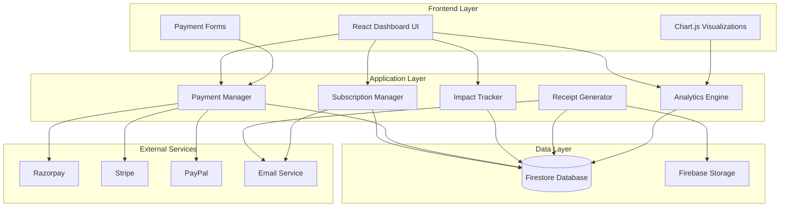
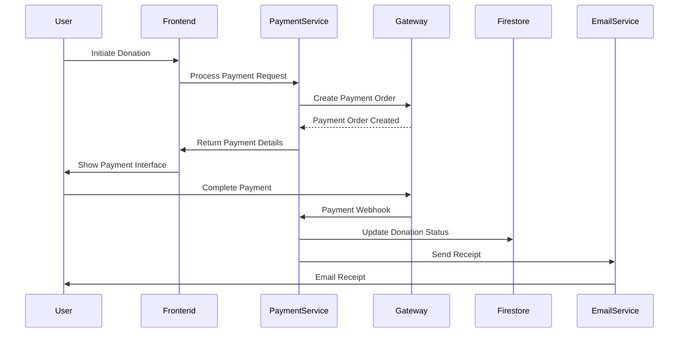

# Enhanced Donation Dashboard - Technical Design

## Overview

The Enhanced Donation Dashboard transforms CityFix's basic donation system into a comprehensive donation platform with recurring subscriptions, multiple payment gateways, impact tracking, and advanced analytics. This design builds upon the existing React 19 + Vite frontend, Firebase/Firestore backend, and current Razorpay integration while adding sophisticated features for donors, welfare centers, and administrators.

The system architecture follows a modular approach with clear separation of concerns between payment processing, subscription management, impact tracking, and user interface components. The design ensures scalability, security, and compliance with financial regulations while maintaining the existing CityFix user experience.

## Architecture

### System Architecture Overview



### Component Architecture

The enhanced donation system consists of several key architectural components:

**Frontend Components:**
- `DonationDashboard`: Main dashboard interface with analytics and controls
- `SubscriptionManager`: Interface for managing recurring donations
- `PaymentGateway`: Unified payment processing interface
- `ImpactTracker`: Visual impact metrics and reporting
- `ReceiptViewer`: Receipt management and download interface

**Backend Services:**
- `SubscriptionService`: Handles recurring payment logic and scheduling
- `PaymentService`: Manages multiple payment gateway integrations
- `ImpactService`: Calculates and tracks donation impact metrics
- `ReceiptService`: Generates receipts and tax documents
- `AnalyticsService`: Processes donation data for insights

**Data Models:**
- Donations, Subscriptions, Impact Metrics, Receipts, Welfare Centers

## Components and Interfaces

### Frontend Component Structure

```
src/components/donation/
├── DonationDashboard.jsx          # Main dashboard component
├── SubscriptionManager.jsx        # Subscription management
├── PaymentGateway.jsx            # Payment processing interface
├── ImpactTracker.jsx             # Impact visualization
├── ReceiptManager.jsx            # Receipt management
├── AnalyticsDashboard.jsx        # Analytics and charts
├── WelfareCenterCard.jsx         # Welfare center display
└── PaymentMethodSelector.jsx     # Payment method selection
```

### Service Layer Architecture

```
src/services/donation/
├── subscriptionService.js        # Subscription management logic
├── paymentService.js            # Payment gateway integration
├── impactService.js             # Impact calculation and tracking
├── receiptService.js            # Receipt generation
├── analyticsService.js          # Data analytics processing
└── taxCalculatorService.js      # Tax benefit calculations
```

### Key Interface Definitions

**Payment Gateway Interface:**
```javascript
interface PaymentGateway {
  processPayment(amount, method, metadata): Promise<PaymentResult>
  setupRecurring(subscription): Promise<SubscriptionResult>
  cancelSubscription(subscriptionId): Promise<CancelResult>
  getPaymentStatus(transactionId): Promise<PaymentStatus>
}
```

**Subscription Manager Interface:**
```javascript
interface SubscriptionManager {
  createSubscription(donorId, amount, frequency, centerId): Promise<Subscription>
  updateSubscription(subscriptionId, updates): Promise<Subscription>
  cancelSubscription(subscriptionId): Promise<void>
  processRecurringPayments(): Promise<ProcessingResult[]>
}
```

**Impact Tracker Interface:**
```javascript
interface ImpactTracker {
  calculateImpact(donationAmount, centerId): Promise<ImpactMetrics>
  updateCenterMetrics(centerId, metrics): Promise<void>
  generateImpactReport(donorId, period): Promise<ImpactReport>
  getAggregateImpact(filters): Promise<AggregateMetrics>
}
```

## Data Models

### Firestore Database Schema

#### Collections Structure

```
/donations/{donationId}
/subscriptions/{subscriptionId}
/welfare_centers/{centerId}
/impact_metrics/{metricId}
/receipts/{receiptId}
/payment_methods/{methodId}
/tax_calculations/{calculationId}
```

#### Donation Document Schema

```javascript
{
  id: string,
  donorId: string,
  donorEmail: string,
  donorName: string,
  centerId: string,
  centerName: string,
  amount: number,
  currency: string,
  paymentMethod: string,
  paymentGateway: string,
  transactionId: string,
  status: 'pending' | 'completed' | 'failed' | 'refunded',
  isRecurring: boolean,
  subscriptionId?: string,
  impactMetrics: {
    category: string,
    estimatedImpact: number,
    unit: string
  },
  taxBenefit: {
    eligible: boolean,
    amount: number,
    section: string
  },
  receiptId: string,
  createdAt: Timestamp,
  updatedAt: Timestamp,
  metadata: {
    userAgent: string,
    ipAddress: string,
    source: string
  }
}
```

#### Subscription Document Schema

```javascript
{
  id: string,
  donorId: string,
  donorEmail: string,
  centerId: string,
  amount: number,
  currency: string,
  frequency: 'monthly' | 'quarterly' | 'yearly',
  paymentMethod: string,
  paymentGateway: string,
  gatewaySubscriptionId: string,
  status: 'active' | 'paused' | 'cancelled' | 'failed',
  nextPaymentDate: Timestamp,
  lastPaymentDate?: Timestamp,
  failedAttempts: number,
  totalDonations: number,
  totalAmount: number,
  createdAt: Timestamp,
  updatedAt: Timestamp,
  pausedUntil?: Timestamp,
  cancellationReason?: string,
  notifications: {
    emailEnabled: boolean,
    reminderDays: number
  }
}
```

#### Welfare Center Document Schema

```javascript
{
  id: string,
  name: string,
  description: string,
  shortDescription: string,
  category: 'old_age_home' | 'orphanage' | 'animal_shelter' | 'environment' | 'education',
  icon: string,
  images: string[],
  location: {
    address: string,
    city: string,
    state: string,
    pincode: string,
    coordinates: GeoPoint
  },
  contact: {
    phone: string,
    email: string,
    website?: string
  },
  registration: {
    number: string,
    type: string,
    taxExemption: boolean,
    section80G: boolean
  },
  founded: string,
  members: string,
  isActive: boolean,
  isVerified: boolean,
  impactMetrics: {
    category: string,
    unit: string,
    costPerUnit: number,
    description: string
  }[],
  totalDonationsReceived: number,
  totalDonors: number,
  averageRating: number,
  createdAt: Timestamp,
  updatedAt: Timestamp
}
```

#### Impact Metrics Document Schema

```javascript
{
  id: string,
  centerId: string,
  donationId?: string,
  subscriptionId?: string,
  category: string,
  impact: {
    quantity: number,
    unit: string,
    description: string
  },
  period: {
    startDate: Timestamp,
    endDate: Timestamp
  },
  verified: boolean,
  verificationDocuments?: string[],
  createdAt: Timestamp,
  updatedAt: Timestamp
}
```

#### Receipt Document Schema

```javascript
{
  id: string,
  donationId: string,
  donorId: string,
  donorDetails: {
    name: string,
    email: string,
    phone?: string,
    address?: string,
    panNumber?: string
  },
  centerDetails: {
    name: string,
    registrationNumber: string,
    address: string,
    section80G: boolean
  },
  amount: number,
  currency: string,
  transactionId: string,
  paymentMethod: string,
  taxBenefit: {
    eligible: boolean,
    amount: number,
    section: string
  },
  receiptNumber: string,
  financialYear: string,
  pdfUrl: string,
  emailSent: boolean,
  emailSentAt?: Timestamp,
  createdAt: Timestamp
}
```

### Database Indexes

```javascript
// Composite indexes for efficient querying
donations: [
  ['donorId', 'createdAt'],
  ['centerId', 'createdAt'],
  ['status', 'createdAt'],
  ['isRecurring', 'createdAt']
]

subscriptions: [
  ['donorId', 'status'],
  ['centerId', 'status'],
  ['nextPaymentDate', 'status'],
  ['status', 'updatedAt']
]

impact_metrics: [
  ['centerId', 'period.startDate'],
  ['donationId', 'createdAt'],
  ['category', 'createdAt']
]

receipts: [
  ['donorId', 'createdAt'],
  ['financialYear', 'donorId'],
  ['donationId']
]
```
### Payment Gateway Integration Design

#### Multi-Gateway Architecture

The system supports multiple payment gateways through a unified interface:

```javascript
class PaymentGatewayFactory {
  static createGateway(type) {
    switch(type) {
      case 'razorpay': return new RazorpayGateway();
      case 'stripe': return new StripeGateway();
      case 'paypal': return new PayPalGateway();
      default: throw new Error('Unsupported gateway');
    }
  }
}
```

#### Gateway Configuration

```javascript
const gatewayConfig = {
  razorpay: {
    keyId: process.env.VITE_RAZORPAY_KEY_ID,
    keySecret: process.env.RAZORPAY_KEY_SECRET,
    webhookSecret: process.env.RAZORPAY_WEBHOOK_SECRET,
    supportedMethods: ['card', 'netbanking', 'wallet', 'upi'],
    currency: 'INR',
    international: false
  },
  stripe: {
    publishableKey: process.env.VITE_STRIPE_PUBLISHABLE_KEY,
    secretKey: process.env.STRIPE_SECRET_KEY,
    webhookSecret: process.env.STRIPE_WEBHOOK_SECRET,
    supportedMethods: ['card', 'bank_transfer'],
    currency: 'USD',
    international: true
  },
  paypal: {
    clientId: process.env.VITE_PAYPAL_CLIENT_ID,
    clientSecret: process.env.PAYPAL_CLIENT_SECRET,
    webhookId: process.env.PAYPAL_WEBHOOK_ID,
    supportedMethods: ['paypal', 'card'],
    currency: 'USD',
    international: true
  }
};
```

#### Payment Processing Flow



### Subscription Management System Design

#### Subscription Lifecycle Management

```javascript
class SubscriptionManager {
  async createSubscription(subscriptionData) {
    // 1. Validate subscription data
    // 2. Create gateway subscription
    // 3. Store in Firestore
    // 4. Schedule first payment
    // 5. Send confirmation email
  }

  async processRecurringPayments() {
    // 1. Query due subscriptions
    // 2. Process payments in batches
    // 3. Handle failures with retry logic
    // 4. Update subscription status
    // 5. Send notifications
  }

  async handleFailedPayment(subscriptionId, attempt) {
    // 1. Increment failure count
    // 2. Calculate next retry time (exponential backoff)
    // 3. Send failure notification
    // 4. Cancel if max attempts reached
  }
}
```

#### Subscription Scheduling

```javascript
// Cloud Function for processing recurring payments
exports.processRecurringPayments = functions.pubsub
  .schedule('0 9 * * *') // Daily at 9 AM
  .onRun(async (context) => {
    const today = new Date();
    const subscriptions = await db.collection('subscriptions')
      .where('status', '==', 'active')
      .where('nextPaymentDate', '<=', today)
      .get();

    const batchPromises = subscriptions.docs.map(doc => 
      processSubscriptionPayment(doc.data())
    );

    await Promise.allSettled(batchPromises);
  });
```

### Impact Tracking and Analytics System

#### Impact Calculation Engine

```javascript
class ImpactCalculator {
  static calculateImpact(donationAmount, centerMetrics) {
    return centerMetrics.map(metric => ({
      category: metric.category,
      quantity: Math.floor(donationAmount / metric.costPerUnit),
      unit: metric.unit,
      description: metric.description
    }));
  }

  static aggregateImpact(donations, period) {
    // Aggregate impact across multiple donations
    // Group by category and sum quantities
    // Calculate trends and growth rates
  }
}
```

#### Analytics Data Processing

```javascript
class AnalyticsEngine {
  async generateDonorInsights(donorId) {
    const donations = await this.getDonorDonations(donorId);
    return {
      totalDonated: donations.reduce((sum, d) => sum + d.amount, 0),
      donationFrequency: this.calculateFrequency(donations),
      preferredCenters: this.getTopCenters(donations),
      impactMetrics: this.aggregateImpact(donations),
      taxSavings: this.calculateTaxSavings(donations),
      trends: this.calculateTrends(donations)
    };
  }

  async generateCenterAnalytics(centerId) {
    // Center-specific analytics
    // Donor demographics, donation patterns, impact metrics
  }
}
```

### Receipt Generation System

#### PDF Receipt Generation

```javascript
class ReceiptGenerator {
  async generateReceipt(donationId) {
    const donation = await this.getDonation(donationId);
    const template = await this.getReceiptTemplate();
    
    const pdfBuffer = await this.createPDF({
      template,
      data: {
        ...donation,
        receiptNumber: this.generateReceiptNumber(),
        qrCode: this.generateQRCode(donation),
        digitalSignature: this.generateSignature(donation)
      }
    });

    const pdfUrl = await this.uploadToStorage(pdfBuffer, donationId);
    await this.saveReceiptRecord(donationId, pdfUrl);
    await this.emailReceipt(donation.donorEmail, pdfUrl);
    
    return pdfUrl;
  }

  generateReceiptNumber() {
    const year = new Date().getFullYear();
    const sequence = this.getNextSequenceNumber();
    return `CF-${year}-${sequence.toString().padStart(6, '0')}`;
  }
}
```

#### Tax Calculation Service

```javascript
class TaxCalculator {
  static calculate80GBenefit(donationAmount, centerRegistration) {
    if (!centerRegistration.section80G) return { eligible: false, amount: 0 };
    
    // 100% deduction for eligible donations under Section 80G
    const maxDeduction = 10000; // As per current tax laws
    const eligibleAmount = Math.min(donationAmount, maxDeduction);
    
    return {
      eligible: true,
      amount: eligibleAmount,
      section: '80G',
      description: `Eligible for 100% deduction up to ₹${maxDeduction}`
    };
  }

  static generateAnnualTaxSummary(donations, financialYear) {
    const eligibleDonations = donations.filter(d => d.taxBenefit.eligible);
    const totalDeduction = eligibleDonations.reduce((sum, d) => sum + d.taxBenefit.amount, 0);
    
    return {
      financialYear,
      totalDonations: donations.length,
      totalAmount: donations.reduce((sum, d) => sum + d.amount, 0),
      eligibleDonations: eligibleDonations.length,
      totalDeduction,
      estimatedTaxSaving: totalDeduction * 0.3 // Assuming 30% tax bracket
    };
  }
}
```

### Security and Compliance Considerations

#### Payment Security

```javascript
// PCI DSS Compliance measures
const securityConfig = {
  encryption: {
    algorithm: 'AES-256-GCM',
    keyRotation: '90days'
  },
  tokenization: {
    provider: 'gateway-native', // Use gateway's tokenization
    scope: 'payment-methods'
  },
  auditLogging: {
    enabled: true,
    retention: '7years',
    fields: ['transactionId', 'amount', 'timestamp', 'status']
  }
};
```

#### Data Protection

```javascript
// GDPR/Privacy compliance
class DataProtectionService {
  static sanitizeUserData(userData) {
    // Remove or hash sensitive information
    return {
      ...userData,
      email: this.hashEmail(userData.email),
      phone: userData.phone ? this.maskPhone(userData.phone) : null,
      panNumber: userData.panNumber ? this.maskPAN(userData.panNumber) : null
    };
  }

  static async handleDataDeletion(userId) {
    // Anonymize donation records while preserving financial audit trail
    // Delete personal information but keep transaction records
  }
}
```

#### Fraud Detection

```javascript
class FraudDetectionService {
  static async analyzeTransaction(transactionData) {
    const riskScore = await this.calculateRiskScore(transactionData);
    
    if (riskScore > 0.8) {
      return { action: 'block', reason: 'High risk score' };
    } else if (riskScore > 0.6) {
      return { action: 'review', reason: 'Medium risk score' };
    }
    
    return { action: 'approve', reason: 'Low risk score' };
  }

  static calculateRiskScore(data) {
    // Implement risk scoring algorithm
    // Consider factors: amount, frequency, location, device, etc.
  }
}
```

### Error Handling Strategy

#### Payment Error Handling

```javascript
class PaymentErrorHandler {
  static handlePaymentFailure(error, context) {
    const errorMap = {
      'insufficient_funds': {
        userMessage: 'Insufficient funds in your account',
        action: 'suggest_alternative_method',
        retry: false
      },
      'card_declined': {
        userMessage: 'Your card was declined',
        action: 'suggest_alternative_method',
        retry: true,
        maxRetries: 3
      },
      'network_error': {
        userMessage: 'Network error occurred',
        action: 'retry_payment',
        retry: true,
        maxRetries: 5
      }
    };

    return errorMap[error.code] || {
      userMessage: 'Payment failed. Please try again.',
      action: 'contact_support',
      retry: false
    };
  }
}
```

#### Subscription Error Recovery

```javascript
class SubscriptionErrorRecovery {
  static async handleRecurringPaymentFailure(subscriptionId, error) {
    const subscription = await this.getSubscription(subscriptionId);
    const failureCount = subscription.failedAttempts + 1;
    
    if (failureCount >= 3) {
      await this.pauseSubscription(subscriptionId, 'payment_failures');
      await this.notifySubscriptionPaused(subscription);
    } else {
      const nextRetry = this.calculateNextRetry(failureCount);
      await this.scheduleRetry(subscriptionId, nextRetry);
      await this.notifyPaymentFailure(subscription, failureCount);
    }
  }

  static calculateNextRetry(attemptNumber) {
    // Exponential backoff: 1 day, 3 days, 7 days
    const delays = [1, 3, 7];
    const delayDays = delays[attemptNumber - 1] || 7;
    return new Date(Date.now() + delayDays * 24 * 60 * 60 * 1000);
  }
}
```
## Correctness Properties

*A property is a characteristic or behavior that should hold true across all valid executions of a system-essentially, a formal statement about what the system should do. Properties serve as the bridge between human-readable specifications and machine-verifiable correctness guarantees.*

After analyzing the acceptance criteria, I identified several properties that can be combined for more comprehensive testing. For example, subscription creation, storage, and processing can be tested together as a complete workflow. Similarly, payment processing across different gateways can be unified into gateway-agnostic properties.

### Property 1: Subscription Frequency Support

*For any* subscription creation request with monthly, quarterly, or yearly frequency, the Subscription_Manager should successfully create and store the subscription with the specified frequency in Firestore_Database.

**Validates: Requirements 1.1, 1.2**

### Property 2: Automated Subscription Processing

*For any* active subscription with a due payment date, the Subscription_Manager should automatically process the payment through the configured gateway and send email notifications 3 days before the payment.

**Validates: Requirements 1.3, 1.4**

### Property 3: Subscription Payment Retry Logic

*For any* failed recurring payment, the Subscription_Manager should retry up to 3 times with exponential backoff, and if all retries fail, should handle the failure appropriately.

**Validates: Requirements 1.5, 7.6**

### Property 4: Subscription Management Operations

*For any* existing subscription, donors should be able to modify amount, frequency, target center, pause for up to 6 months, or cancel immediately with confirmation sent.

**Validates: Requirements 1.6, 1.7, 7.2, 7.3, 7.7**

### Property 5: Multi-Gateway Payment Support

*For any* payment request, the Payment_Gateway should support processing through Razorpay, Stripe, or PayPal with appropriate payment methods (UPI, cards, net banking, wallets) based on the selected gateway.

**Validates: Requirements 2.1, 2.2, 2.3, 2.6**

### Property 6: Secure Payment Data Storage

*For any* processed payment, the Donation_System should store payment method details in masked format in Firestore_Database and tokenize sensitive data.

**Validates: Requirements 2.4, 8.6**

### Property 7: Payment Error Handling

*For any* failed payment, the Donation_System should display specific error messages and suggest alternative payment methods based on the failure type.

**Validates: Requirements 2.5**

### Property 8: Impact Calculation and Tracking

*For any* donation made to a welfare center, the Impact_Tracker should calculate estimated impact based on the center's metrics and record the impact data correctly.

**Validates: Requirements 3.1, 3.2**

### Property 9: Impact Reporting and Visualization

*For any* time period, the Impact_Tracker should generate accurate monthly reports and display visual charts showing both individual and collective impact metrics with support for custom categories.

**Validates: Requirements 3.3, 3.4, 3.5, 3.6**

### Property 10: Impact Metrics Management

*For any* welfare center administrator, the system should allow updating impact metrics through the admin interface with proper verification requirements.

**Validates: Requirements 3.7, 9.2**

### Property 11: Automatic Receipt Generation

*For any* completed donation, the Receipt_Generator should automatically generate a digital receipt within 5 minutes containing all required information (donor details, amount, center info, transaction ID, registration numbers, tax details) in PDF format with digital signatures.

**Validates: Requirements 4.1, 4.2, 4.5, 4.6, 4.7**

### Property 12: Tax Benefit Calculation

*For any* donation to an eligible welfare center, the Tax_Calculator should correctly calculate 80G tax benefits according to Indian tax laws and generate accurate annual tax summary reports.

**Validates: Requirements 4.3, 4.4**

### Property 13: Dashboard Data Display

*For any* donor accessing the dashboard, the interface should display complete donation history with filtering capabilities, subscription details, summary metrics (total donations, impact, tax savings), and personalized recommendations.

**Validates: Requirements 5.1, 5.2, 5.3, 5.7**

### Property 14: Dashboard Export and Visualization

*For any* dashboard view, the system should provide downloadable reports in PDF and CSV formats, display upcoming payments with modification options, and show donation trends through interactive charts.

**Validates: Requirements 5.4, 5.5, 5.6**

### Property 15: Analytics Time Period Support

*For any* analytics request, the Dashboard_Interface should correctly aggregate and display data for monthly, quarterly, and yearly views with accurate calculations.

**Validates: Requirements 6.1**

### Property 16: Donation Analytics and Insights

*For any* donor with donation history, the Analytics_Engine should generate insights about patterns and trends, show comparative impact across centers, display distribution by category, and calculate efficiency metrics.

**Validates: Requirements 6.2, 6.3, 6.4, 6.5, 6.7**

### Property 17: Goal Tracking

*For any* donor with set annual donation targets, the Dashboard_Interface should accurately track and display progress toward goals.

**Validates: Requirements 6.6**

### Property 18: Subscription Display and Notifications

*For any* donor with subscriptions, the Subscription_Manager should display all active subscriptions with correct next payment dates and send reminder notifications before renewals.

**Validates: Requirements 7.1, 7.5**

### Property 19: Subscription Cancellation Feedback

*For any* subscription cancellation, the system should provide feedback options for improvement and collect the feedback appropriately.

**Validates: Requirements 7.4**

### Property 20: High-Value Donation Security

*For any* donation above ₹10,000, the Donation_System should require two-factor authentication before processing the payment.

**Validates: Requirements 8.2**

### Property 21: Fraud Detection

*For any* suspicious transaction pattern, the Payment_Gateway should implement fraud detection mechanisms and flag or block suspicious activities.

**Validates: Requirements 8.4**

### Property 22: Audit Trail Generation

*For any* financial transaction, the Donation_System should create secure audit trails with all necessary transaction details.

**Validates: Requirements 8.7**

### Property 23: Campaign Management

*For any* administrator, the system should allow creating and managing donation campaigns with specific needs, duration, and targets.

**Validates: Requirements 9.1, 9.5**

### Property 24: Goal Setting and Progress Tracking

*For any* administrator, the system should allow setting donation goals and accurately track progress toward those goals.

**Validates: Requirements 9.3**

### Property 25: Donor Communication

*For any* welfare center, the system should allow sending thank you messages to donors and provide anonymized donor analytics.

**Validates: Requirements 9.4, 9.6**

### Property 26: Financial Reporting

*For any* administrator, the system should generate accurate financial reports for transparency purposes.

**Validates: Requirements 9.7**

### Property 27: Data Backup and Recovery

*For any* day, the system should implement automated daily backups of all donation data, encrypt backups, and store them in multiple locations.

**Validates: Requirements 10.2, 10.6**

### Property 28: Data Validation and Integrity

*For any* data storage operation, the system should maintain data integrity through validation rules and reject invalid data.

**Validates: Requirements 10.3**

### Property 29: Real-time Synchronization

*For any* data change, the Firestore_Database should support real-time synchronization across all user interfaces.

**Validates: Requirements 10.4**

### Property 30: Data Retention Compliance

*For any* stored data, the system should implement data retention policies complying with financial regulations.

**Validates: Requirements 10.5**

## Error Handling

### Payment Processing Errors

The system implements comprehensive error handling for payment processing:

**Gateway-Specific Errors:**
- Network timeouts and connectivity issues
- Invalid payment method errors
- Insufficient funds notifications
- Card declined scenarios
- Authentication failures

**Error Recovery Strategies:**
- Automatic retry with exponential backoff for transient errors
- Alternative payment method suggestions for permanent failures
- Graceful degradation when gateways are unavailable
- User-friendly error messages with actionable guidance

### Subscription Management Errors

**Subscription Processing Errors:**
- Failed recurring payments with retry logic
- Gateway subscription creation failures
- Subscription modification conflicts
- Payment method expiration handling

**Error Recovery:**
- Automatic payment retry with increasing intervals
- Subscription pause for repeated failures
- Email notifications for payment issues
- Manual intervention options for administrators

### Data Consistency Errors

**Database Operation Errors:**
- Transaction rollback for failed operations
- Conflict resolution for concurrent updates
- Data validation failures
- Backup and recovery procedures

**Consistency Maintenance:**
- Atomic operations for critical data updates
- Event sourcing for audit trails
- Eventual consistency handling for distributed operations
- Data integrity checks and validation

## Testing Strategy

### Dual Testing Approach

The Enhanced Donation Dashboard requires both unit testing and property-based testing for comprehensive coverage:

**Unit Testing Focus:**
- Specific payment gateway integrations
- Receipt PDF generation with exact formatting
- Tax calculation edge cases (boundary values, special scenarios)
- Email notification delivery
- Database schema validation
- Error handling for specific failure modes
- Integration points between components

**Property-Based Testing Focus:**
- Universal properties that hold across all donation amounts and frequencies
- Subscription lifecycle management across different scenarios
- Impact calculation accuracy across various center types
- Data consistency across concurrent operations
- Security properties for payment processing
- Analytics accuracy across different time periods

### Property-Based Testing Configuration

**Testing Framework:** Use `fast-check` for JavaScript property-based testing
**Test Configuration:**
- Minimum 100 iterations per property test
- Custom generators for donation amounts, frequencies, and center types
- Shrinking enabled for minimal failing examples
- Timeout configuration for async operations

**Property Test Tagging:**
Each property-based test must include a comment referencing its design document property:
```javascript
// Feature: enhanced-donation-dashboard, Property 1: Subscription Frequency Support
```

### Test Data Management

**Test Environment Setup:**
- Isolated Firestore emulator for testing
- Mock payment gateways for deterministic testing
- Test data generators for realistic scenarios
- Cleanup procedures for test isolation

**Data Generation Strategies:**
- Random donation amounts within realistic ranges
- Various subscription frequencies and durations
- Different welfare center types and impact metrics
- Edge cases for boundary testing
- Invalid data for error handling validation

### Integration Testing

**End-to-End Scenarios:**
- Complete donation flow from selection to receipt
- Subscription creation and management lifecycle
- Impact tracking and reporting workflows
- Dashboard analytics and visualization
- Multi-gateway payment processing
- Error recovery and retry mechanisms

**Performance Testing:**
- Load testing for concurrent donations
- Subscription processing at scale
- Database query performance
- Report generation efficiency
- Real-time synchronization under load

This comprehensive testing strategy ensures the Enhanced Donation Dashboard meets all functional requirements while maintaining high reliability, security, and performance standards.